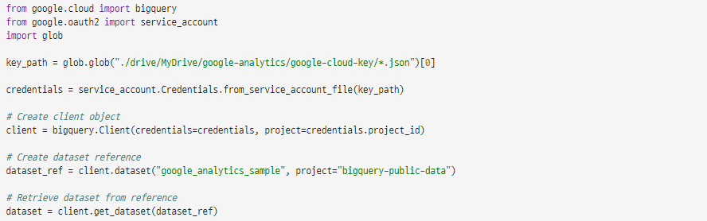
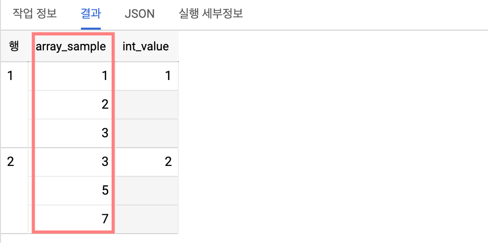
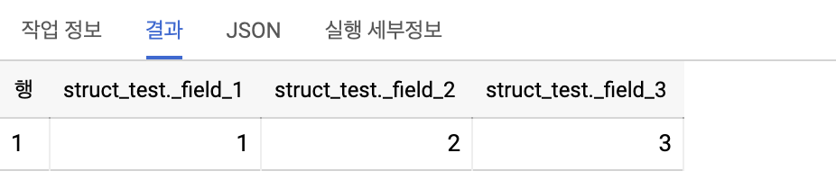
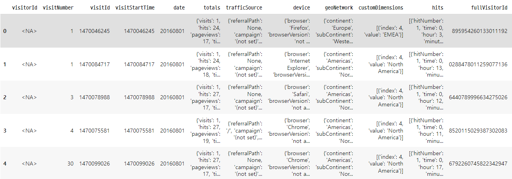
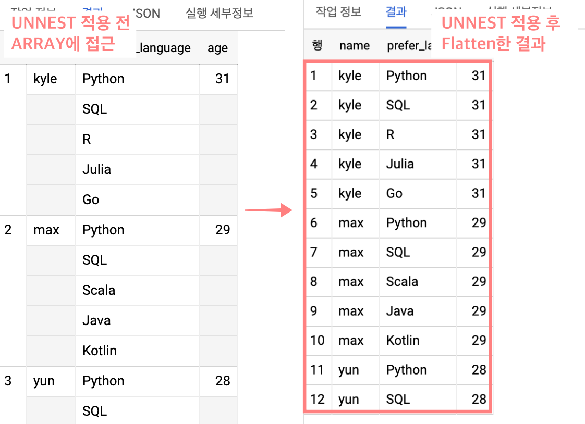
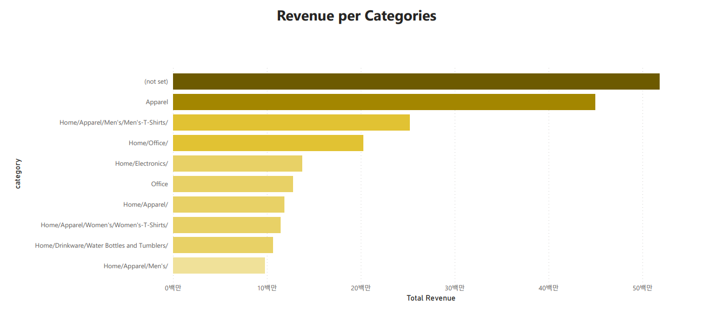
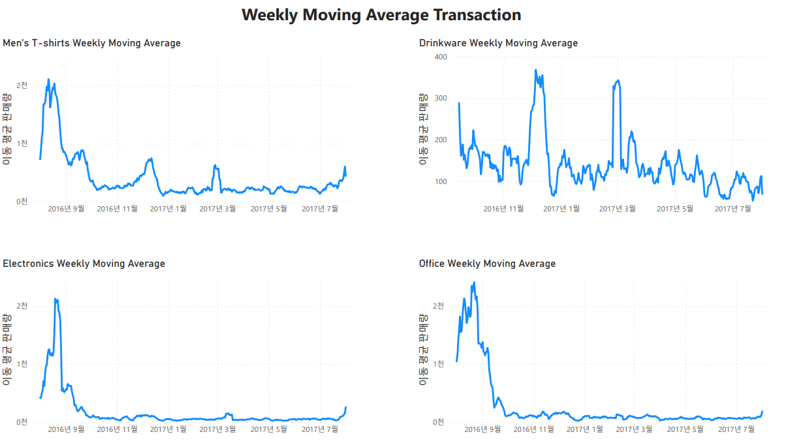
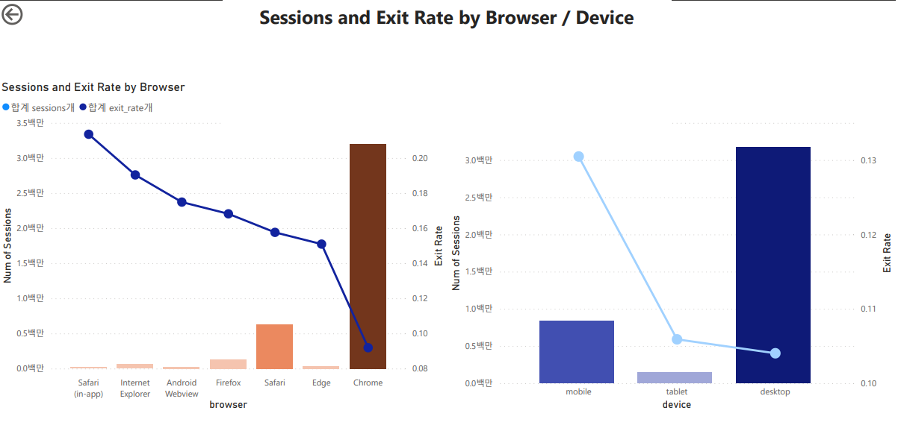
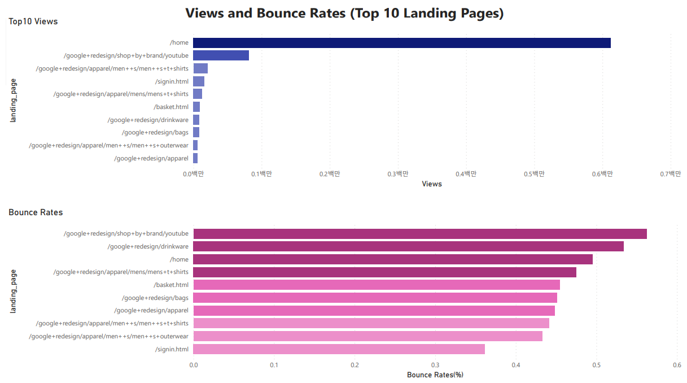
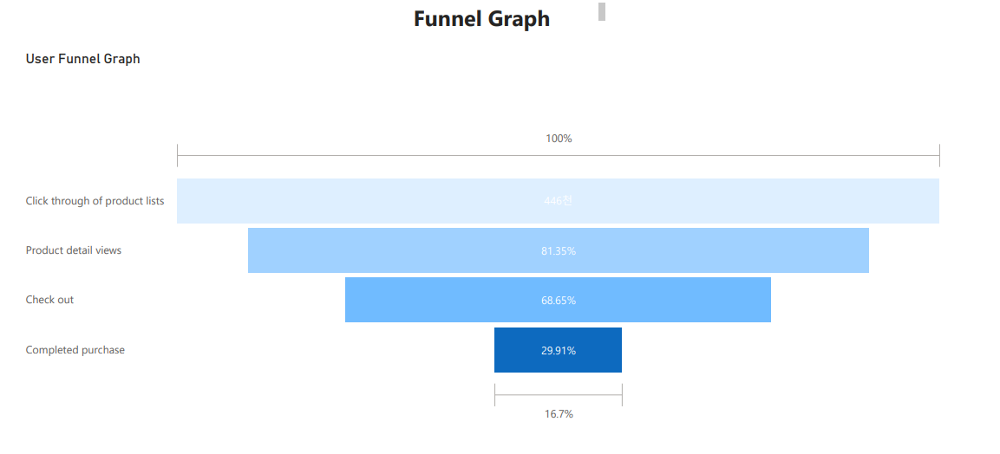

# Bigquery-google-analytics-data

### 목표 : BigQuery SQL을 활용한 데이터 로드와 시각화

- 세부목표
1. Kaggle 필사를 통한 BigQuery - Python 학습
2. SQL문을 활용한 데이터 로드
3. POWER BI를 활용한 시각화

#### 1. Bigquery - Python

구글 클라우드에서 프로젝트를 생성한 후 json 형식의 key를 다운로드 받을 수 있음. 
이후 위와 google 라이브러리를 통해 쉽게 연결이 가능.

#### 2. Bigquery SQL
Bigquery는 [Array, Struct type](https://cloud.google.com/bigquery/docs/reference/standard-sql/data-types#struct-type)의 데이터 구조를 지원한다. 
Array 타입은 한 행과 열에 데이터 타입이 동일한 여러 값을 저장하며,
Sturct 타입은 파이썬의 데이터 프레임 안에 딕셔너리 데이터를 저장하는 것처럼, 필드 안에 필드가 있는 형태로 보인다. 
아래 사진은 그 예시이다.

(image source : https://zzsza.github.io/gcp/2020/04/12/bigquery-unnest-array-struct/) 
1행 array_sample 필드에 1,2,3이라는 값이 저장되어 있으며, bigquery UI상으로는 위와 같이 표현된다.

(image source : https://zzsza.github.io/gcp/2020/04/12/bigquery-unnest-array-struct/) 
struct_test라는 필드 안에 _field_1, _field_2, _field_3가 포함된 계층 구조처럼 보인다. 

실제 파이썬 dataframe으로 google-analytics 샘플 데이터를 불러오면 아래 사진과 같이 데이터 프레임 안에 dictionary 형태로 데이터가 저장된다.(JSON 포멧과 비슷한 것 같음)  
이와 같은 형식의 데이터를 조건문을 활용한 SQL문으로 불러오고자 한다면 아래 이미지와 같이 UNNEST를 적용하여 Cross join한 형태의 데이터를 사용해야하며,
본 필사 코드에도 같은 형태로 쿼리문을 작성하였다.

(image source : https://zzsza.github.io/gcp/2020/04/12/bigquery-unnest-array-struct/) 

#### 3. POWER BI를 사용한 시각화

사실 그래프는 POWER BI 연습을 위해 Kaggle 필사 내용에 있는 그래프를 POWER BI로 옮긴 것이다. 
다른 점은 아래와 같다.
1. 아래 시각화 자료에는 Bar 그래프의 색상에 함수를 적용하여 구간별로 다른 색을 사용
2. Sessions and Exit Rate 부분의 실선 그래프(Exit rate)는 어떤 추세를 보여주는 시계열과 관련된 내용이 아닌 각각의 수치를 시각화하는 것으로 Bar 그래프로 표현하는 것이 더 적합해보인다. 그러나 이중축 Bar 그래프를 사용하는 방법을 찾지 못해 어쩔 수 없이 실선으로 표현

처음으로 POWER BI를 사용해본 개인적인 소감은 Tableau보다 UI가 친숙하여 사용하기 쉬웠고, 무료 버젼도 데이터베이스와 연결을 지원하여 다양한 테스트가 가능할 것으로 보인다.

